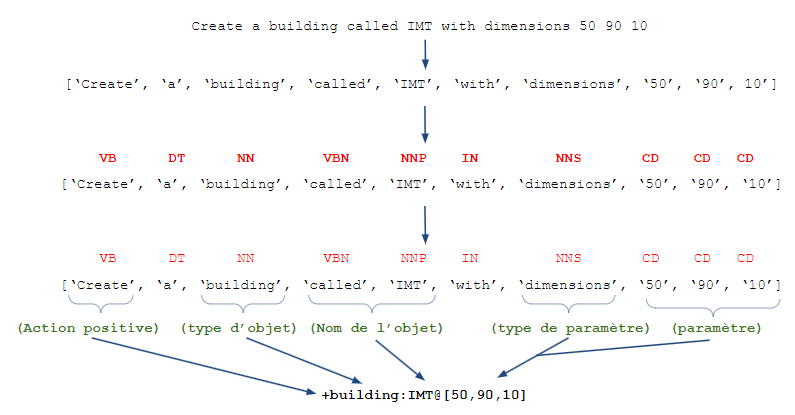

## THE PROJECT

This project, sponsored by Orness, aims to transcribe instructions written in natural language into commands understandable for the CLI.  
This plugin integrates with OGrEE, a digital twin tool.

The plugin is divided into 2 parts : the understanding of the sentence and the smart placement (solver). The understanding part can be autonomous.

See an example below :

CAUTION : This whole plugin uses the large model __*en_core_web_lg*__. It has large memory size : one could use the medium size model (replace lg with md). The small model will NOT work (see https://spacy.io/models/en).

Note : You must download the model on your computer / container : https://spacy.io/usage/models

## IMPORTANT DETAILS

The library used to perform NLP processing is Spacy. Learn more here : https://spacy.io/usage/linguistic-features

This plugin is NOT AI-powered or ML-powered. It is using logical arguments to get comprehensive understanding of a sentence.  
The use of spacy was precisely chosen to enable a future implementation of machine learning.

All the criteria used come from the wiki : https://github.com/ditrit/OGrEE-Core/wiki

## INSTRUCTIONS

To launch, execute __*ogree_main.py*__

- Please only give 1 instruction per sentence (creation, destruction or modification of 1 object)
- Write explicitly the name of entities : "building", "rack"...
- Be precise, a lack of information could lead to non understanding
- Write names in upper case
